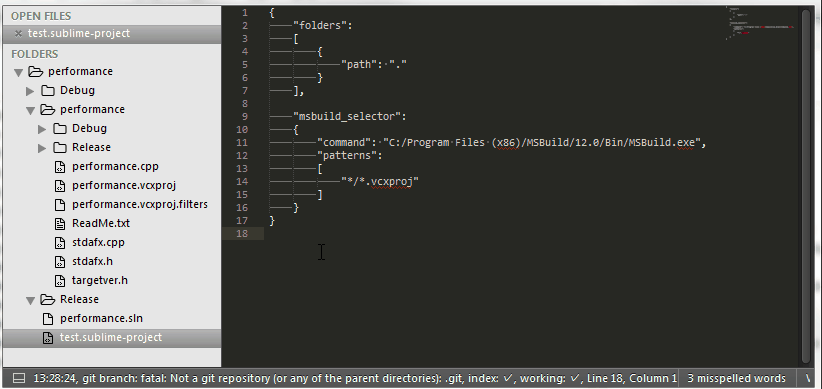

# MSBuild Selector
Build your *Visual Studio* solutions using *MSBuild*.

## What it provides

**MSBuild Selector** is a build system for *MSBuild* users allowing them to:
* Build the whole solution
* Build one of the project that contain the file currently edited
* Build the file currently edited

Each build option is available in all the *Platform/Configuration* pairs.

## Startup configuration

To activate it, select the **MSBuildSelector** build system, you need a *Sublime* project that you will configure to have:

	"msbuild_selector":
	{
		# A mandatory list of glob patterns to find the sub-projects (named simply projects
		# in VS)
		"patterns":	[
			"path/to/projects/*.vcxproj"
		],
	}

Note that *patterns* is mandatory and should contains only path relatives to the project root.

After that your just have to press the build shortcut (**CTRL-B** or **F7**).

## Additional configuration

Here a more complete example of configuration:

	"msbuild_selector":
	{
		# Path to MSBUILD
		"command": "path/to/msbuild.exe",

		# An optional list of "root projects" a.k.a solutions in the VS world that
		# will be added to the panel to build
		"projects": [
			{
				"name": "Project name",
				"file_name": "Project.build.proj",
				"directory": "Path/to/project/"
			}
		],

		# List of platforms you want to be able to build on.
		# Default is Win32/x64
		"platforms":
		[
			"x64"
		],

		# List of configuration you want to be able to build on.
		# Default is Release/Debug
		"configurations":
		[
			"Release"
		],

		# A mandatory list of glob patterns to find the sub-projects
		# (named simply projects in VS)
		"patterns":	[
			"path/to/projects/*.vcxproj",
			"path/to/projects/*.csxproj",
		],

		# Optional environment variables that will be passed to MSBuild process
		"environment": {
			"MY_VAR": "my_value"
		},

		# Regexp to match error (see build system documentation)
		# Default is "^\\s*(.+)\\(([0-9]+)\\)\\s*:\\s*(.*)"
		"file_regex": "^\\s*(.+)\\(([0-9]+)\\)\\s*:\\s*(.*)"
	}

## Additional commands

It also provides two commands:
* *"msbuild_selector_project"*: allows to launch the build on a project or a solution find with the patterns. It will open the quick panel to allow selection of what has to be build.
* *"msbuild_selector_file"*: try to find the projects where the file exists and open a quick panel to allow selection of what to build. It is the command used by the build system.
